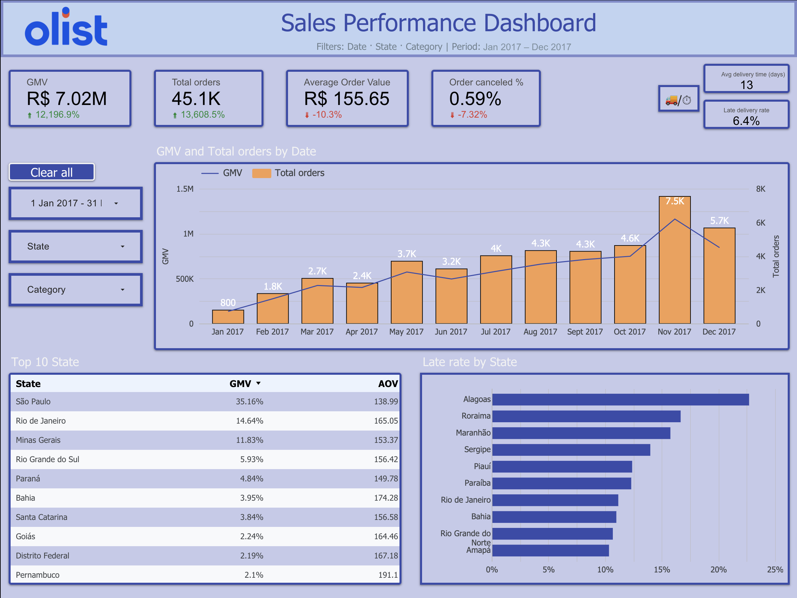

# Olist E-commerce analytics
Olist e-commerce performance &amp; customer reviews — Python cleaning + BigQuery SQL + Looker Studio dashboard (2017 FY &amp; 2018 YTD) with actionable insights

Live dashboard:
https://lookerstudio.google.com/reporting/9bf77bf9-0da9-4c79-8745-28d9893c480a

## Results

2017 (full year): GMV R$ 7.02M, 45.1K orders, AOV R$ 155.7, Canceled 0.59%, Avg delivery 13 days, Late rate 6.4%, 44,573 reviews (14.7% negative).

2018 YTD (Jan–Aug vs Jan–Aug 2017): GMV R$ 8.55M (+140.9%), Orders 54.0K (+135.1%), AOV R$ 158.4 (+2.5%), Canceled 0.58% (−0.16 pp), Late rate 9.2% (↑ vs 4.0% PY).

Top negative reason: Delivery delay (~49–52% of negatives).

Highest severity reason: Wrong / Not as described (~75–80% rated 1–2/5).

Impact plan (next 30–60 days): cut late rate −1 pp in hotspot states (AL/MA/CE), reduce negative reviews −1 pp (delivery-delay share −5 pp), grow AOV +1–2% on high-ticket categories, keep canceled ≤ 0.6%.

## Why I built this

Understand Olist’s sales performance, category mix, and customer pain points, then turn findings into an actionable plan that Ops, CX and Growth can execute.

## Stack

Python - cleaning (Drop isna, duplicated, columns)

BigQuery – SQL table + view final_data_enriched

Looker Studio – interactive 3-page report (report-level filters)

SQL – CTEs, date logic, KPI calculations

## Data model 

One row per order with:

gmv = price + freight

product_category & customer_state (cleaned)

order_purchase_timestamp, order_delivered_customer_date, order_estimated_delivery_date

delivery_days = date diff (delivered − purchase)

is_late = delivered > estimated

Reviews analyzed by score bands (1–2 / 3 / 4–5) and reason (grouped)

## KPI definitions (BigQuery-style)

### -- GMV
SUM(oi.price + oi.freight_value) AS gmv

### -- Orders
COUNT(DISTINCT o.order_id) AS orders_total

### -- AOV
SAFE_DIVIDE(SUM(oi.price + oi.freight_value), COUNT(DISTINCT o.order_id)) AS aov

### -- Canceled %
SAFE_DIVIDE(COUNTIF(o.order_status = 'canceled'),
            COUNT(DISTINCT o.order_id)) AS canceled_rate

### -- Late rate
SAFE_DIVIDE(COUNTIF(order_delivered_customer_date > order_estimated_delivery_date),
            COUNT(DISTINCT o.order_id)) AS late_rate

### -- Avg delivery time (days)
AVG(DATE_DIFF(order_delivered_customer_date, order_purchase_timestamp, DAY)) AS avg_delivery_days

### -- Negative reviews %
SAFE_DIVIDE(COUNTIF(review_score <= 2), COUNT(*)) AS negative_reviews_pct

## What’s inside the report

### Page 1 – Sales Performance
KPI cards (GMV, Orders, AOV, Canceled %, Avg delivery days, Late rate), GMV & Orders trend (combo), Top-10 states, Late rate by state.

### Page 2 – Category Performance
KPI cards, Growth vs PY by category (GMV share & Δ%), Category × State heatmap, Top-5 GMV by category, Top-5 AOV by category.

### Page 3 – Customer Reviews & Reasons
100% stacked review trend (High/Medium/Low), Severity × Prevalence bubble chart, table with Share of all reviews, % negative within reason, % of total negatives.

Filters (report-level, persistent across pages): Date · State · Category.
Button Clear all resets the whole report.

## Key insights (data-driven)

2018 is scaling fast (like-for-like): GMV +140.9%, Orders +135.1%, AOV +2.5%.

Risk: on-time delivery – Late rate up to 9.2% (from 4.0% PY Jan–Aug); hotspots: Alagoas → Maranhão → Ceará.

Customer voice – Delivery delay drives about half of all negative reviews; Wrong/Not as described has very high severity.

Growth levers – High-ticket Computers (AOV ~R$1.2–1.3K) and selected Appliances; GMV leaders Bedding & Bath, Health & Beauty, Sports & Leisure.

Regional play – SP/RJ/MG support premium AOV; target local bundles & financing.

## Actions & expected impact

Ops – Reduce late deliveries (AL/MA/CE): tighten carrier SLAs, add fallback carrier, daily on-time dashboard & alerts, clearer cut-offs, first-mile controls, proactive ETA comms (auto SMS/e-mail when ETA > SLA with new ETA + goodwill).
CX – Fix “Not as described”: double-scan at packout + photo proof; clarify PDP titles/variants/photos.
Growth – Monetize high-AOV & protect volume: bundles + financing for Computers/Appliances (geo-target SP/RJ/MG); for Bedding & Bath / Health & Beauty ensure stock health, price monitoring, cross-sell.

## Success metrics (60 days):

Late rate −1 pp (AL/MA/CE)

Negative reviews −1 pp (delivery-delay share −5 pp)

AOV +1–2% on high-ticket categories

Canceled ≤ 0.6%

## How to run

BigQuery

Build a view/table final_data_enriched with fields above and the KPI logic.

Ensure date fields are DATE/TIMESTAMP and categories/states are cleaned.

Looker Studio

Connect the table & view as a data source.

Use report-level controls (Date, State, Category).

For YoY on charts, set Comparison date range = Previous year.

## Limitations

2016 partial (Sep–Dec). 2018 data available Jan–Aug only; YoY comparisons use Jan–Aug vs Jan–Aug.

Review reasons are grouped; linking every review to an order may vary by dataset completeness.

## Contact

Samy Bouhassoune – Data Analyst
LinkedIn: https://www.linkedin.com/in/samy-bouhassoune · Email: samyy.b@hotmail.fr

## 🇫🇷 Résumé

2017 : R$ 7.02M GMV, 45.1K commandes, AOV R$ 155.7, Annulés 0.59%, Livraison 13 j, Retards 6.4%, 44,573 avis (14.7% négatifs).

2018 YTD (jan–août vs N-1) : GMV +140.9%, Commandes +135.1%, AOV +2.5%, Annulés 0.58% (−0.16 pt), Retards 9.2%.

Priorités : baisser les retards (AL/MA/CE), corriger “non conforme”, pousser les catégories à fort AOV, protéger les best-sellers.
